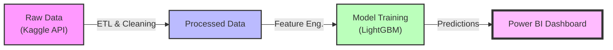
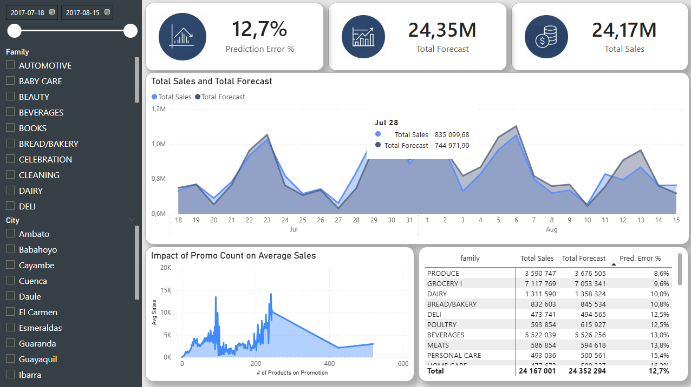

# 🛒 Smart Retail Forecasting: End-to-End Demand Prediction System

## 📌 Project Overview
This project is a hybrid **Data Science & Business Intelligence** solution designed for a retail chain. The primary goal is to optimize inventory management by generating accurate daily sales forecasts for the next 14 days across multiple store locations.

The system bridges the gap between raw data and business decision-making by combining **Machine Learning models** (Prophet & LightGBM) with an interactive **Power BI Dashboard**.

### 🎯 Business Objective
* **Problem:** Inefficient inventory planning leading to **stockouts** (lost revenue) or **overstock** (increased holding costs).
* **Solution:** An automated pipeline that predicts demand, detects anomalies, and visualizes KPIs for store managers.
* **Key Metrics:** RMSE (Root Mean Square Error), WAPE (Weighted Absolute Percentage Error).

---

## ⚙️ Architecture & Workflow

The solution follows a modular architecture, separating the forecasting engine from the reporting layer.

🛠️ Tech Stack
Core & Analysis
- Python 3.10+: Main programming language.
- Pandas & NumPy: Data manipulation and aggregation.
- Statsmodels: Time series decomposition and statistical tests.
Machine Learning
- Prophet: Baseline model for capturing seasonality and trend.
- LightGBM: Gradient boosting framework used as the production model (efficient handling of categorical features and large datasets).
- Scikit-learn: Preprocessing and metrics evaluation.
MLOps & Engineering
- MLflow: Experiment tracking (logging parameters, metrics, and artifacts).
- Kaggle API: Automated data ingestion.
Business Intelligence
- Microsoft Power BI: Interactive dashboard for stakeholders.
- DAX: Custom measures for WoW (Week-over-Week) growth and forecast accuracy.

📂 Project Structure
retail-forecasting/
├── data/
│   ├── raw/            # Raw data from Kaggle (immutable)
│   └── processed/      # Cleaned data and final predictions for Power BI
├── notebooks/          # Jupyter notebooks for EDA and prototyping
├── src/                # Source code for production pipeline
│   ├── data_loader.py  # Data ingestion scripts
│   └── training.py     # Model training logic
├── reports/            # Power BI files (.pbix) and exports
├── mlruns/             # MLflow local tracking logs
├── requirements.txt    # Project dependencies
└── README.md           # Project documentation

🚀 Getting Started
1. Prerequisites
Python 3.10 or higher
Kaggle Account & API Key (kaggle.json)
Power BI Desktop (for viewing the dashboard)

2. Installation
Clone the repository and install dependencies:
git clone [https://github.com/kacper-kaczmarczyk/retail-forecasting.git](https://github.com/kacper-kaczmarczyk/retail-forecasting.git)
cd retail-forecasting

# Create virtual environment
python -m venv venv
# Activate (Windows):
.\venv\Scripts\activate
# Activate (Mac/Linux):
source venv/bin/activate

# Install libraries
pip install -r requirements.txt

3. Data Setup
Place your kaggle.json key in the default location (~/.kaggle/ or %USERPROFILE%\.kaggle\). Then run the initialization script to download data and generate a sample for Power BI:
python src/00_setup_toy_data.py

🗺️ Roadmap
[x] Phase 1: Setup & Data Engineering
- Environment config, Kaggle API integration.
- "Toy Data" generation for BI pipeline testing.

[x] Phase 2: Exploratory Data Analysis (EDA)
- Seasonality detection, promotion impact analysis.

[x] Phase 3: Modeling
- Baseline (Prophet) vs. Advanced (LightGBM).
- Feature Engineering (Lags, Rolling windows, Holidays).
- Hyperparameter tuning & MLflow tracking.

[x] Phase 4: Dashboarding
- Power BI report implementation (Sales vs Forecast, Anomalies).

[x] Phase 5: Final Evaluation
- Business impact summary and documentation.

## 📊 Results: Executive Dashboard

The final output is an interactive Power BI dashboard designed for store managers and supply chain executives.

### Key Insights Delivered:
* **High-Precision Forecasting:** The global LightGBM model achieved a Weighted Mean Absolute Percentage Error (WMAPE) of just **12.7%**, significantly outperforming baseline models. Major product categories like 'PRODUCE' and 'GROCERY I' show even higher accuracy (errors under 10%).
* **Promotional Impact Verified:** Analysis confirmed a strong positive correlation between active promotions and average daily sales volume, validating marketing effectiveness (see the "Impact of Promo Count" chart).
* **Granular Error Tracking:** The interactive matrix allows immediate identification of high-variance categories (e.g., niche items like 'BOOKS') versus stable, predictable, high-volume sellers.

### How to run the dashboard:
1.  Ensure you have run the Python pipeline to generate `data/processed/final_forecasts.csv`.
2.  Open the `reports/Retail_Demand_Forecast_v1.0.pbix` file in Power BI Desktop.
3.  Click "Refresh" to load the latest predictions.

📝 License
This project is for educational purposes, based on the Store Sales - Time Series Forecasting dataset.
